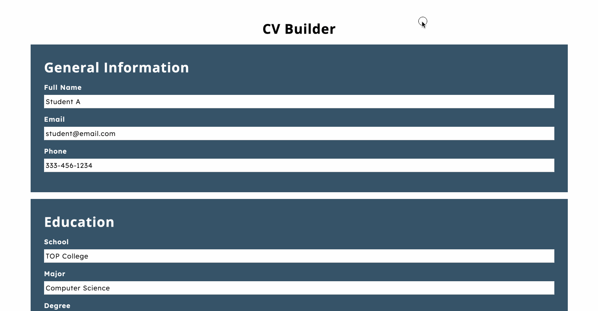

# React CV Application 📄

This [simple CV (Resume) Builder](https://devkarenc.github.io/react-cv-project/) lets you enter CV-related information such as Education and Experience.

## Learning Outcomes 👩🏻‍💻

- [x] Utilize the React.js Framework
- [x] Review the basics of React.js including the components, states, and the props system
- [x] Conditional Rendering based on state
- [x] Pass down props from parent to child components

## Demo

